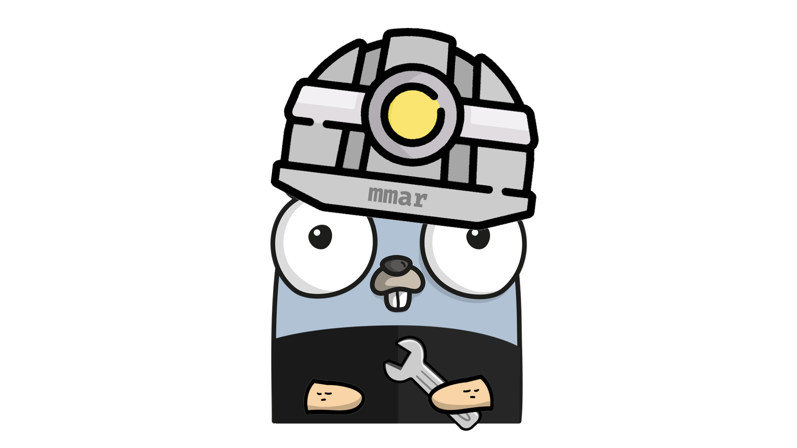
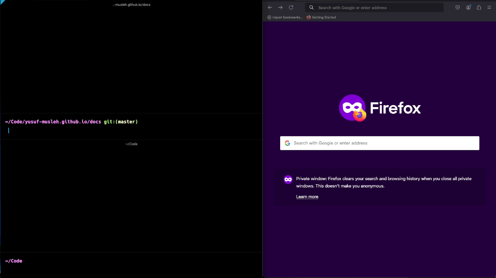

<p align="center">
    <picture>
      
    </picture>
</p>

# mmar

mmar (pronounced "ma-mar") is a zero-dependency, self-hostable, cross-platform HTTP tunnel that exposes your localhost to the world on a public URL.

It allows you to quickly share what you are working on locally with others without the hassle of a full deployment, especially if it is not ready to be shipped.

### Demo

<p align="center">
    <picture>
      
    </picture>
</p>

### Key Features

- Super simple to use
- Provides "mmar.dev" to tunnel for free on a generated subdomain
- Custom subdomain names support
- Expose multiple ports on different subdomains
- Live logs of requests coming into your localhost server
- Zero dependencies
- Self-host your own mmar server to have full control
- Authentication system with API keys and tunnel limits

### Limitations

- Currently only supports the HTTP protocol, other protocols such as websockets were not tested and will likely not work
- Requests through mmar are limited to 10mb in size, however this could be made configurable in the future
- There is a limit of 5 mmar tunnels per IP to avoid abuse, this could also be made configurable in the future

### Learn More

The development, implementation and technical details of mmar has all been documented in a [devlog series](https://ymusleh.com/tags/mmar.html). You can read more about it there.

_p.s. mmar means “corridor” or “pass-through” in Arabic._

## Installation

### Linux/MacOS

Install mmar

```sh
sudo curl -sSL https://raw.githubusercontent.com/yusuf-musleh/mmar/refs/heads/master/install.sh | sh
```

### MacOS (Homebrew)

Use [Homebrew](https://brew.sh/) to install `mmar` on MacOS:

```
brew install yusuf-musleh/mmar-tap/mmar
```

If you already have it installed and want to update it to the latest release:

```
brew upgrade yusuf-musleh/mmar-tap/mmar
```

### Docker

The fastest way to create a tunnel what is running on your `localhost:8080` using [Docker](https://www.docker.com/) is by running this command:

```
docker run --rm --network host ghcr.io/yusuf-musleh/mmar:v0.2.6 client --local-port 8080
```

### Windows

See Docker or Manual installation instructions

### Manually

Download a [Release](https://github.com/yusuf-musleh/mmar/releases/) from Github that is compatible with your OS, extract/locate the `mmar` binary and add it somewhere in your PATH.

## Quick Start

1. Check that you have `mmar` installed

```
$ mmar version
mmar version 0.2.1
```

1. Make sure you have your localhost server running on some port (eg: 8080)
1. Run the `mmar` client, pointing it to your localhost port

```
$ mmar client --local-port 8080

2025/02/02 16:26:54 Starting mmar client...
  Creating tunnel:
    Tunnel Host: mmar.dev
    Local Port: 8080

2025/02/02 16:26:54 Tunnel created successfully!

A mmar tunnel is now open on:

>>>  https://7v0aye.mmar.dev -> http://localhost:8080
```

You can also specify a custom subdomain name:

```
$ mmar client --local-port 8080 --custom-name myapp

2025/02/02 16:26:54 Starting mmar client...
  Creating tunnel:
    Tunnel Host: mmar.dev
    Local Port: 8080

2025/02/02 16:26:54 Tunnel created successfully!

A mmar tunnel is now open on:

>>>  https://myapp.mmar.dev -> http://localhost:8080
```

You can also specify an authentication token:

```
$ mmar client --local-port 8080 --auth-token my-secret-token

2025/02/02 16:26:54 Starting mmar client...
  Creating tunnel:
    Tunnel Host: mmar.dev
    Local Port: 8080

2025/02/02 16:26:54 Tunnel created successfully!

A mmar tunnel is now open on:

>>>  https://abc123.mmar.dev -> http://localhost:8080
```

1. That's it! Now you have an HTTP tunnel open through `mmar.dev` on a randomly generated unique subdomain
1. Access this link from anywhere and you should be able to access your localhost server
1. You can see all the options `mmar` by running the help command:

```
$ mmar --help
mmar is an HTTP tunnel that exposes your localhost to the world on a public URL.

Usage:
  mmar <command> [command flags]

Commands:
  server
    Runs a mmar server. Run this on your publicly reachable server if you're self-hosting mmar.
  client
    Runs a mmar client. Run this on your machine to expose your localhost on a public URL.
  version
    Prints the installed version of mmar.


Run `mmar <command> -h` to get help for a specific command
```

### Configuring through Environment Variables

You can define the various mmar command flags in environment variables rather than passing them in with the command. Here are the available environment variables along with the corresponding flags:

```
MMAR__SERVER_HTTP_PORT     -> mmar server --http-port
MMAR__SERVER_TCP_PORT      -> mmar server --tcp-port
MMAR__SERVER_API_KEYS_FILE -> mmar server --api-keys-file
MMAR__LOCAL_PORT           -> mmar client --local-port
MMAR__TUNNEL_HTTP_PORT     -> mmar client --tunnel-http-port
MMAR__TUNNEL_TCP_PORT      -> mmar client --tunnel-tcp-port
MMAR__TUNNEL_HOST          -> mmar client --tunnel-host
MMAR__CUSTOM_NAME          -> mmar client --custom-name
MMAR__API_KEY              -> mmar client --api-key
MMAR__API_KEYS_FILE        -> mmar server --api-keys-file
```

## Authentication

MMAR supports authentication using API keys to control tunnel creation and limits. This is useful for self-hosted deployments where you want to control access and resource usage.

### Server Configuration

To enable authentication on the server, create an API keys file (YAML format) and specify it when starting the server:

```yaml
# api-keys.yaml
key1: 100
test-token: 5
demo-key: 10
```

Start the server with authentication:

```bash
$ mmar server --api-keys-file api-keys.yaml
```

### Client Usage

Clients must provide a valid authentication token when creating tunnels:

```bash
$ mmar client --local-port 8080 --auth-token key1
```

### Features

- **Token Validation**: Only tokens listed in the API keys file are accepted
- **Tunnel Limits**: Each token has a maximum number of concurrent tunnels
- **Automatic Cleanup**: Tunnel counts are automatically updated when tunnels are created/destroyed
- **Error Handling**: Clear error messages for invalid tokens or exceeded limits

### Environment Variables

You can configure authentication using environment variables:

```bash
export MMAR__API_KEYS_FILE="/path/to/api-keys.yaml"
export MMAR__API_KEY="my-secret-token"
```

## Self-Host

Since everything is open-source, you can easily self-host mmar on your own infrastructure under your own domain.

To deploy mmar on your own VPS using docker, you can do the following:

1. Make sure you have your VPS already provisioned and have ssh access to it.
1. Make sure you already own a domain and have the apex domain as well as wildcard subdomains pointing towards your VPS's public IP. It should look something like this:

   | Type     | Host | Value           | TTL  |
   | -------- | ---- | --------------- | ---- |
   | A Record | \*   | 123.123.123.123 | Auto |
   | A Record | @    | 123.123.123.123 | Auto |

   This would direct all your tunnel subdomains to your VPS for mmar to handle.

1. Next, make sure you have docker installed on your VPS, and create a `compose.yaml` file and add the mmar server as a service:

   ```yaml
   services:
     mmar-server:
       image: "ghcr.io/yusuf-musleh/mmar:v0.2.3" # <----- make sure to use the mmar's latest version
       restart: unless-stopped
       command: server
       environment:
         - USERNAME_HASH=[YOUR_SHA256_USERNAME_HASH]
         - PASSWORD_HASH=[YOUR_SHA256_PASSWORD_HASH]
       ports:
         - "3376:3376"
         - "6673:6673"
   ```

   The `USERNAME_HASH` and `PASSWORD_HASH` env variables are the hashes of the credentials needed to access the stats page, which can be viewed at `stats.yourdomain.com`. The stats pages returns a json with very basic information about the number of clients connected (i.e. tunnels open) along with a list of the subdomains and when they were created:

   ```json
   {
     "connectedClients": [
       {
         "createdOn": "2025-03-01T08:01:46Z",
         "id": "owrwf0"
       }
     ],
     "connectedClientsCount": 1
   }
   ```

1. Next, we need to also add a reverse proxy, such as [Nginx](https://nginx.org/) or [Caddy](https://caddyserver.com/), so that requests and TCP connections to your domain are routed accordingly. Since the mmar client communicates with the server using TCP, you need to make sure that the reverse proxy supports routing on TCP, and not just HTTP.

   I highly recommend [Caddy](https://caddyserver.com/) as it also handles obtaining SSL certificates for your wildcard subdomains automatically for you, in addition to having a Layer4 reverse proxy to route TCP connections. To get this functionality we need to include a few additional Caddy modules, the [layer4 module](github.com/mholt/caddy-l4) as well as the [caddy-dns](https://github.com/caddy-dns) module that matches your domain registrar, in my case I am using the [namecheap module](https://github.com/caddy-dns/namecheap) in order to automatically issue SSL certificates for wildcard subdomains.

   To add those modules you can build a new docker image for Caddy including these modules:

   ```
   FROM caddy:2.9.1-builder AS builder

   RUN xcaddy build \
   --with github.com/mholt/caddy-l4 \
   --with github.com/caddy-dns/namecheap

   FROM caddy:2.9.1

   COPY --from=builder /usr/bin/caddy /usr/bin/caddy
   ```

   Next we need to configure Caddy for our setup, let's define a `Caddyfile`:

   ```
   # Layer4 reverse proxy TCP connection to TCP port
   {
       layer4 {
               example.com:6673 {
                       route {
                               tls
                               proxy {
                                       upstream mmar-server:6673
                               }
                       }
               }
       }
   }

   # Redirect to repo page on Github
   example.com {
       redir https://github.com/yusuf-musleh/mmar
   }

   # Reverse proxy HTTP requests to HTTP port
   *.example.com {
       reverse_proxy mmar-server:3376
       tls {
               resolvers 1.1.1.1
               dns namecheap {
                       api_key API_KEY_HERE
                       user USERNAME_HERE
                       api_endpoint https://api.namecheap.com/xml.response
                       client_ip IP_HERE
               }
       }
   }
   ```

   Now that we have the new Caddy image and we defined out Caddyfile, we just need to update out `compose.yaml` file to start Caddy:

   ```yaml
   services:
     caddy:
       image: custom-caddy:2.9.1
       restart: unless-stopped
       ports:
         - "80:80"
         - "443:443"
         - "443:443/udp"
       volumes:
         - ./Caddyfile:/etc/caddy/Caddyfile
         - caddy_data:/data
         - caddy_config:/config
     mmar-server:
       image: "ghcr.io/yusuf-musleh/mmar:v0.2.3" # <----- make sure to use the mmar's latest version
       restart: unless-stopped
       command: server
       environment:
         - USERNAME_HASH=[YOUR_SHA256_USERNAME_HASH]
         - PASSWORD_HASH=[YOUR_SHA256_PASSWORD_HASH]
       ports:
         - "3376:3376"
         - "6673:6673"

   volumes:
     caddy_data:
     caddy_config:
   ```

   That's it! All you need to do is run `docker compose up -d` and then check the logs to make sure everything is running as expected, `docker compose logs --follow`.

1. To create a tunnel using your self-hosted mmar tunnel run the following command on your local machine:

   ```
   $ mmar client --tunnel-host example.com --local-port 8080
   ```

   That should open a mmar tunnel through your self-hosted mmar server pointing towards your `localhost:8080`.

## License

[AGPL-3.0](https://github.com/yusuf-musleh/mmar#AGPL-3.0-1-ov-file)

## Attributions

Attributions for the mmar gopher logo:

- [gopherize.me](https://gopherize.me/)
- <a href="https://www.vecteezy.com/free-vector/icons">Icons Vectors by Vecteezy</a>
